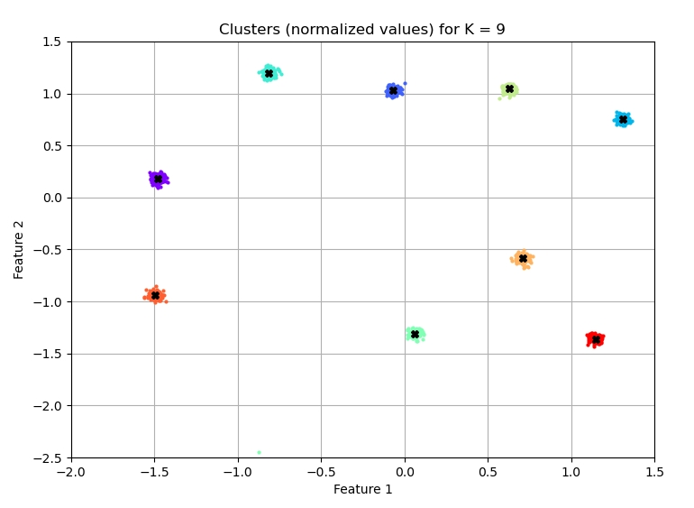
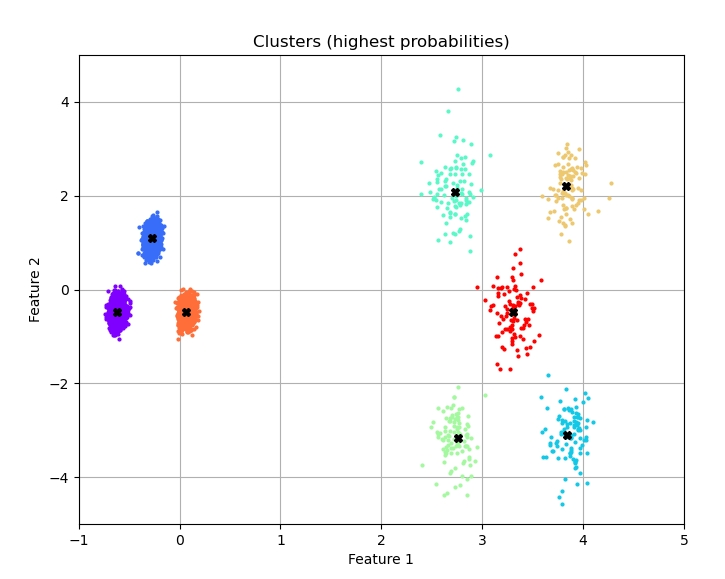
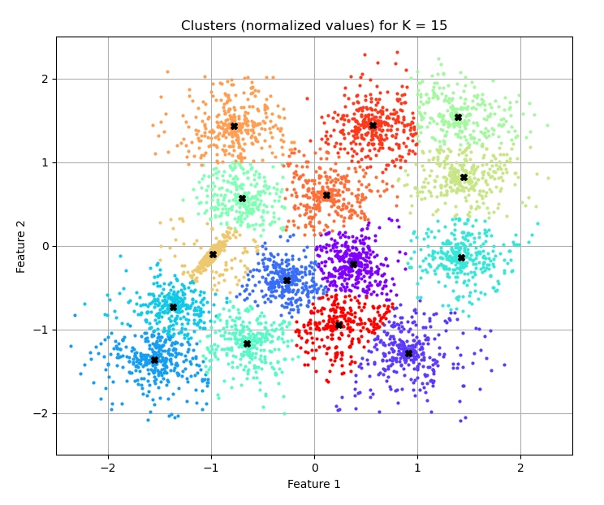

# K-means and Fuzzy C-means Clustering Using a Naive Algorithm and Particle Swarm Optimization

## Features

- The code has been written and tested in Python 3.8.8.

- Two clustering methods (K-means and fuzzy C-means) and two solvers (naive algorithm and PSO).

- For the K-means clustering method:

  - the distance from the cluster centers is assumed as clustering error;
  - the function minimized is the sum of squared errors;
  - the silhouette coefficient and Davies–Bouldin index are available metrics;
  - the function *assign_data* can be used to classify new data.

- For the fuzzy C-means clustering method:

  - the weighted distance from the cluster centers is assumed as clustering error;
  - the function minimized is the sum of (weighted) squared errors;
  - the Dunn's and Kaufman's fuzzy partition coefficients are available metrics;
  - the function *calc_U* can be used to classify new data.

- Usage: *python test.py example*.

## Main Parameters

`example` Name of the example to run (*g2*, *dim2*, *unbalance*, *s3*)

`nPop`, `epochs` Number of agents (population) and number of iterations.

`K`, `K_list` Number of clusters.

`n_rep` Number of repetitions (re-starts) in the naive algorithm.

`max_iter` Max. number of iterations in the naive algorithm.

`func` Name of the interface function for the PSO.

`m` Fuzziness coefficient in the fuzzy C-means method.

`tol` Convergency tolerance in the fuzzy C-means method.

The other PSO parameters are used with their default values (see *pso.py*).

## Examples

**Example 1**

K-means using PSO, 2 clusters, 8 features, 2048 samples.

```python
Cluster centers:
[[600, 600, 600, 600, 600, 600, 600, 600],
 [500, 500, 500, 500, 500, 500, 500, 500]]

Found solution:
[[599.06 598.27 599.21 600.61 600.05 598.84 600.48 599.4 ]
 [499.76 499.45 499.9  500.92 497.64 498.66 499.48 499.39]]

Max. error [%]: 0.473
```

**Example 2**

K-means using naive algorithm, 2 to 15 clusters, 2 features, 1351 samples, siluhouette coefficient and Davies–Bouldin index as metrics.



**Example 3**

Fuzzy C-means using PSO, 8 clusters (unbalanced), 2 features, 6500 samples.



**Example 4** Fuzzy C-means using naive algorithm, 2 to 20 clusters, 2 features, 5000 samples, Dunn's and Kaufman's fuzzy partition coefficients as metrics.



## References

- [K-means clustering](https://en.wikipedia.org/wiki/K-means_clustering)

- [Fuzzy C-means clustering](https://en.wikipedia.org/wiki/Fuzzy_clustering)

- [PSO code](https://github.com/gabrielegilardi/PSO.git).

- [Datasets for the examples](http://cs.joensuu.fi/sipu/datasets/.)
